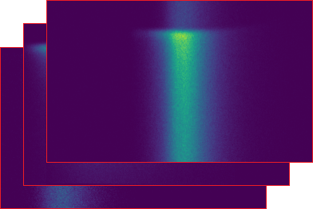
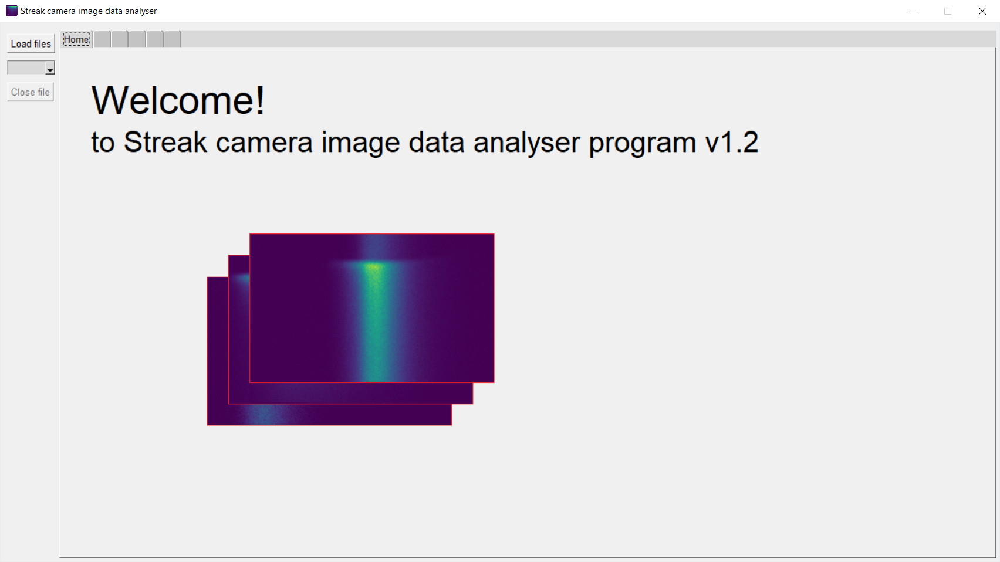
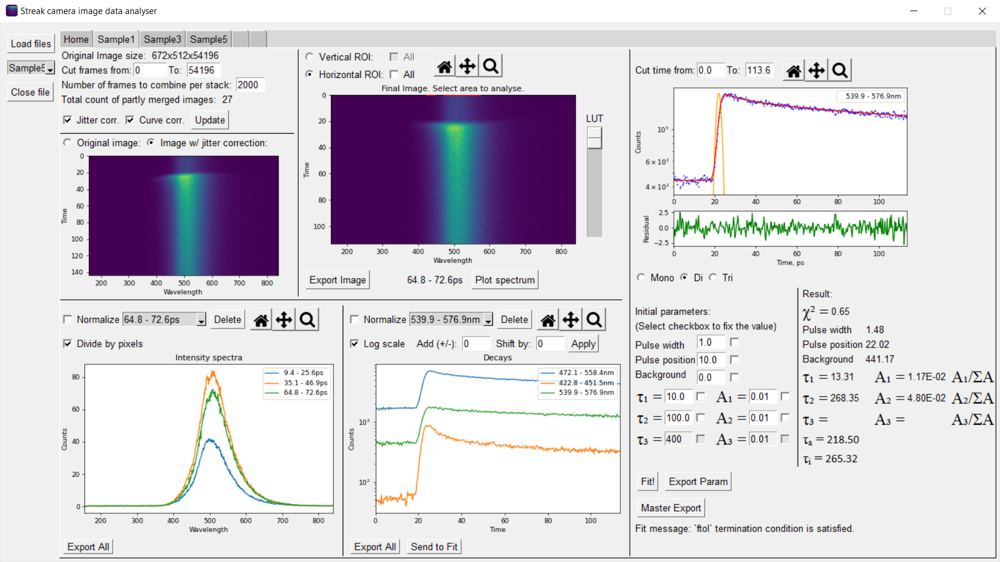

# Streak camera image data analyser

The creation of this program was to simplify the analysis of the images obtained from [streak camera](https://en.wikipedia.org/wiki/Streak_camera) Orca R2
made by [Hamamatsu](https://www.hamamatsu.com/jp/en/product/photometry-systems/streak-camera.html).
This program undergoes [CC BY 4.0](https://github.com/D1s1ntegrator/programs-public/blob/main/streak-image-analyser/LICENSE.md) license,
which means it is open source and can be used or modified in any way you want, but you must reference the author by full name or [DOI]().

## Features

- Grafic user interface (GUI)
- Uses DPC image files `.dpc` for importing data
- Frame selection range
- Jitter correction
- Curve correction
- Photon intensity sensitivity (LUT)
- Horizontal image data selection for intensity plotting
- Division of data by selected pixel count
- Vertical image data selection for intensity decay plotting
- Normalization of data
- Photon decay curve fitting with exponents
- Parameter fixing
- Calculation of intensity and amplitude-weighted average lifetimes
- Data exporting

## Usage

The program was designed to work on Windows. In the `win` folder executable files can be found. The Python scripts could be run on other OS, but this is not tested. 
There are two versions of the program: with interpolation and without interpolation. The first one is denoted with `interp`. 
During correction, the data is shifted in the time domain and the step size is not exact through all timestamps.
For this reason, interpolation is applied. However, it reduces noise. As a result, the chi-squared value will be artificially lowered after fitting spectral decay plots.
A user can choose between these two versions.

## Application screenshot

## Code

Python 3.7 was used to create this program. External packages are listed as follows:

- [PySimpleGUI](https://www.pysimplegui.org/)
- [Numpy](http://www.numpy.org/)
- [Scipy](https://www.scipy.org/)
- [Matplotlib](https://matplotlib.org/)

## Changelog

- v1.0 - Initial program version
- v1.1 - Updated curve correction algorithm
- v1.2 - Added multiwindow support
